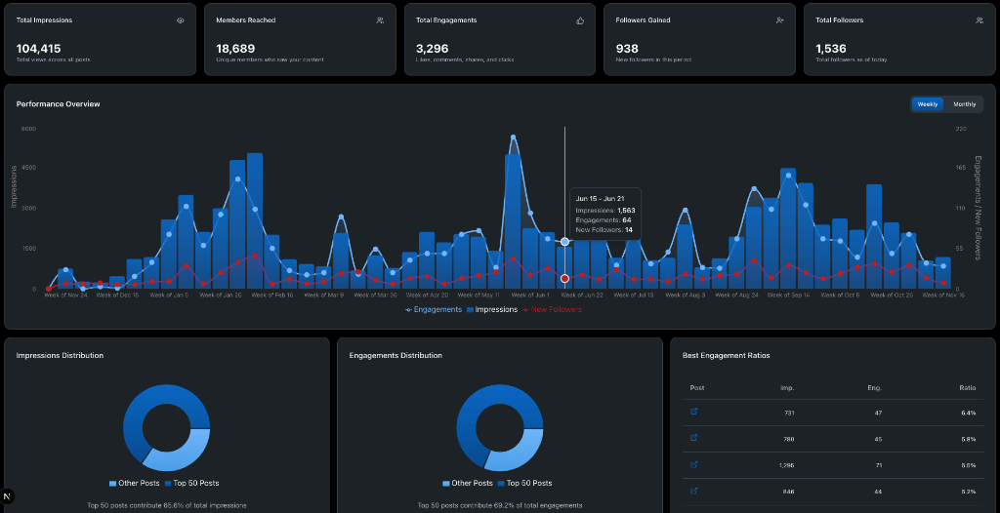

# LinkedIn Insights


**LinkedIn Insights** is a privacy-first, client-side analytics dashboard that transforms your LinkedIn export data into actionable visual insights.

Designed with a "privacy-by-design" philosophy, this application processes all data locally in your browser. Your raw Excel files are **never uploaded** to any server or database.

## � Screenshot



## �🚀 Key Features

- **🔒 Privacy First**: 100% client-side processing. Your data never leaves your device.
- **📊 Interactive Dashboard**: Visualize Impressions, Engagements, and Follower growth over time.
- **📈 Top Posts Analysis**: Deep dive into your best-performing content with distribution charts and engagement ratios.
- **🌗 Dark Mode**: sleek, LinkedIn-inspired dark theme for comfortable viewing.
- **⚡ Instant Parsing**: Drag-and-drop your official LinkedIn Analytics export for immediate results.
- **📱 Responsive Design**: Fully optimized for desktop and tablet viewing.

## 🛠️ Tech Stack

- **Framework**: [Next.js 16](https://nextjs.org/) (App Router)
- **Language**: [TypeScript](https://www.typescriptlang.org/)
- **Styling**: [Tailwind CSS](https://tailwindcss.com/) & [Shadcn/UI](https://ui.shadcn.com/)
- **Charts**: [Recharts](https://recharts.org/)
- **Data Processing**: [SheetJS (xlsx)](https://sheetjs.com/)
- **Infrastructure**: Docker & Docker Compose

## 🏁 Getting Started

### Prerequisites

- [Docker](https://www.docker.com/) & Docker Compose
- *Or* [Node.js](https://nodejs.org/) v18+ (for local development)

### 🐳 Quick Start (Docker)

1. **Clone the repository**
   ```bash
   git clone https://github.com/philipmoses/linkedin-insights.git
   cd linkedin-insights
   ```

2. **Set up Environment Variables**
   Create a `.env.local` file in the root directory (optional, for Firebase Analytics):
   ```env
   NEXT_PUBLIC_FIREBASE_API_KEY=your_key
   NEXT_PUBLIC_FIREBASE_AUTH_DOMAIN=your_domain
   NEXT_PUBLIC_FIREBASE_PROJECT_ID=your_project_id
   # ... other firebase config
   ```

3. **Start Development Environment**
   ```bash
   docker-compose -f dev.docker-compose.yml up
   ```
   - App running at: `http://localhost:3000`
   - Hot-reload enabled

4. **Start Production Environment**
   ```bash
   docker-compose up -d --build
   ```
   - App running at: `http://localhost:3000`
   - Optimized production build

### 💻 Local Development (No Docker)

1. **Install dependencies**
   ```bash
   npm install
   ```

2. **Run the development server**
   ```bash
   npm run dev
   ```

3. **Open your browser**
   Navigate to `http://localhost:3000`

## � Project Structure

```
src/
├── app/                # Next.js App Router pages
├── components/         # React components
│   ├── dashboard/      # Analytics specific components (Charts, KPIs)
│   ├── layout/         # Layout components (Header, Footer)
│   └── ui/             # Reusable UI components (Buttons, Cards, etc.)
├── lib/                # Utilities and helper functions
│   ├── excel-parser.ts # Logic for parsing LinkedIn Excel exports
│   └── utils.ts        # General utilities
└── types/              # TypeScript type definitions
```

## 🤝 Contributing

Contributions are welcome! Please feel free to submit a Pull Request.

1. Fork the project
2. Create your feature branch (`git checkout -b feature/AmazingFeature`)
3. Commit your changes (`git commit -m 'Add some AmazingFeature'`)
4. Push to the branch (`git push origin feature/AmazingFeature`)
5. Open a Pull Request

## 📄 License

This project is licensed under the MIT License - see the [LICENSE](LICENSE) file for details.

---
Built with *[Google Antigravity](https://antigravity.google)* by [House Of FOSS](https://houseoffoss.com)
